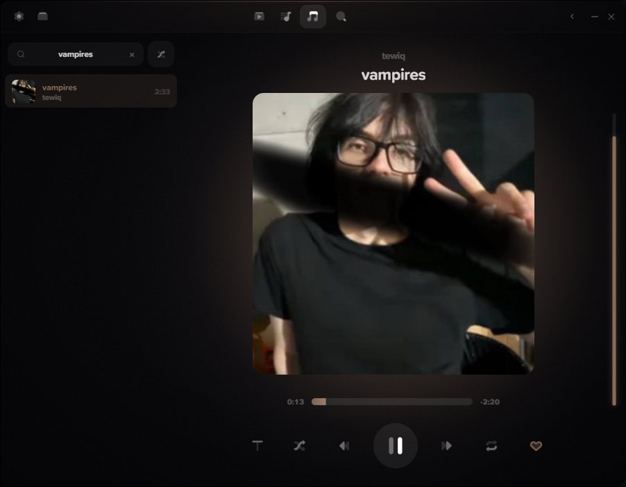

<div align="center">

✦ ✦ ✦

# seWer

### ♪ музыкальный плеер с разбором SoundCloud ♪

✦ ✦ ✦

</div>

---

<div align="center">

</div>

---

## Как начать

```
╔══════════════════════════════════════════════════════╗
║                                                      ║
║                    ⬇  СКАЧАТЬ  ⬇                      ║
║                                                      ║
║     seWer.Tauri_1.0.0_x64-setup.exe                   ║
║                                                      ║
║        всего 3,4 МБ  ·  Windows 10 или 11            ║
║                                                      ║
╚══════════════════════════════════════════════════════╝
```

**→ [Скачать последнюю версию](../../releases/latest)**

1. Скачай файл
2. Запусти его
3. Всё. Плеер открыт 🎧

---

## Что внутри

```
┌──────────────────────────────────────────────────┐
│                                                  │
│   ♪  SoundCloud — лайки, плейлисты, поиск         │
│                                                  │
│   ✎  Правка плейлистов — двигай, удаляй,          │
│      переименовывай, меняй обложку                │
│                                                  │
│   ♪  Своя музыка — папку с mp3 выбрал и забыл     │
│                                                  │
│   ⬇  Скачать трек к себе                         │
│                                                  │
│   💬  Discord — видно, что ты слушаешь,           │
│      с картинкой и временем                       │
│                                                  │
│   🖥  Трей, горячие клавиши, сворачивание в трей  │
│                                                  │
└──────────────────────────────────────────────────┘
```

---

## Если что-то пошло не так

```
┌─ Не открывается ─────────────────────────────────┐
│                                                   │
│  Не хватает WebView2. Скачай тут:                  │
│  https://developer.microsoft.com/microsoft-edge/   │
│                    webview2/                       │
│                                                   │
└───────────────────────────────────────────────────┘

┌─ Windows SmartScreen ругается ────────────────────┐
│                                                   │
│  Это нормально. Нажми «Подробнее»,                │
│  потом «Выполнить в любом случае».                │
│                                                   │
└───────────────────────────────────────────────────┘

┌─ Где мои настройки ────────────────────────────────┐
│                                                   │
│  %APPDATA%\sewer-tauri                            │
│                                                   │
└───────────────────────────────────────────────────┘
```

---

## Хотишь сам собрать?

Нужен **Node.js 18+**, **Rust** и **MSVC Build Tools**.

```
git clone https://github.com/despoyledporcelain/sewer-tauri.git
cd sewer-tauri
npm install
npm run app:dev
```

---

<div align="center">

✦ ✦ ✦

**seWer** — сделано для тех, кто слушает

[⬆ наверх](#sewer)

</div>
